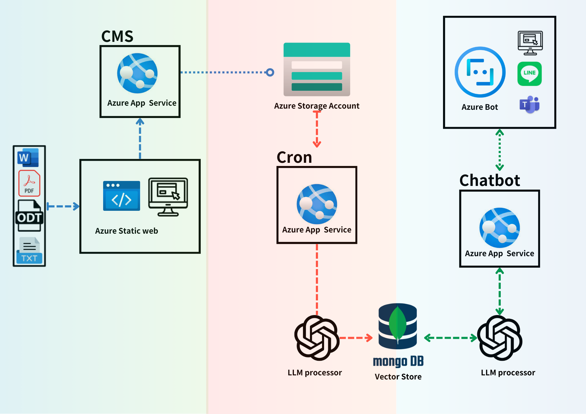

# Trendychat

Trendychat is a core library designed to support applications utilizing large language models (LLMs). It includes comprehensive functionalities such as CMS, scheduled ETL processes, and bot-based interactions.

## Features

Trendychat powers several key services by providing the necessary backend support:
- **Content Management System (CMS)**: Facilitates the organization and management of digital content, which is crucial for dynamic LLM applications.
- **ETL Scheduling**: Automates the extraction, transformation, and loading of data to ensure that the LLMs have timely and relevant data feeds.
- **Bot Interactions**: Supports automated responses and user interactions through intelligent bots, enhancing the user experience and engagement.

## Installation

Install Trendychat using pip:

```bash
pip install trendychat
```
If you need to process PDF files, the unstructured package with PDF support must be installed separately due to its large size:

```bash
pip install unstructured"[pdf]"
```

## Design Philosophy

Trendychat is partly inspired by the design principles of [Langchain](https://github.com/langchain-ai), especially in the areas of data processing and content management. We adopt established methodologies to ensure robust and efficient handling of digital content and data workflows.

However, recognizing the rapid evolution in model API interactions, chain logic, and agent architectures, Trendychat diverges significantly in these aspects. Our library has been designed from the ground up to support flexible, rapid development and easy maintenance. We prioritize modularity and low dependency to adapt swiftly to changing requirements and new opportunities in model integration. This approach helps in avoiding the maintenance challenges and dependency issues commonly faced in fast-paced development environments.

By crafting a hybrid design that blends proven principles with innovative practices, Trendychat aims to provide a stable yet adaptable foundation for building and scaling LLM applications.


## Architecture Diagram

Below is the architectural diagram illustrating the supported structure and flow of interactions within Trendychat. This visualization helps in understanding how different components are integrated.



